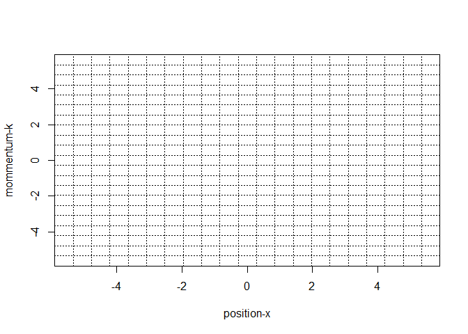
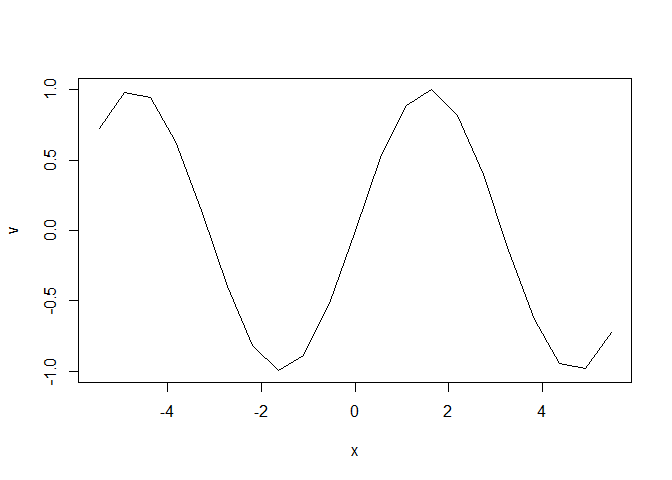
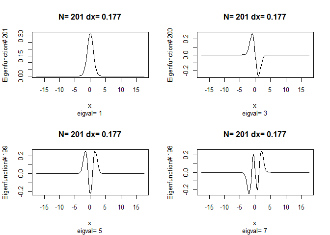
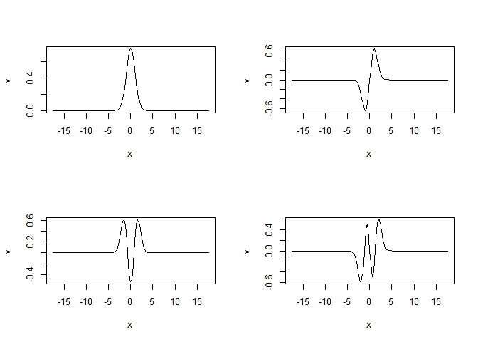
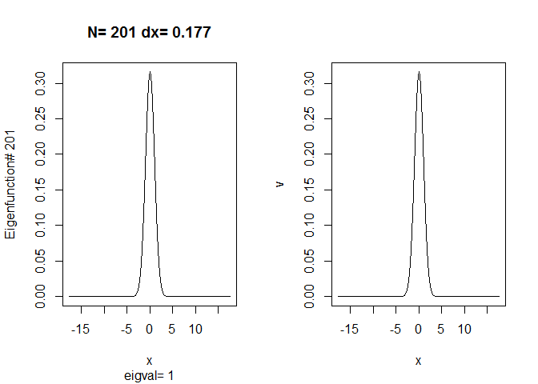
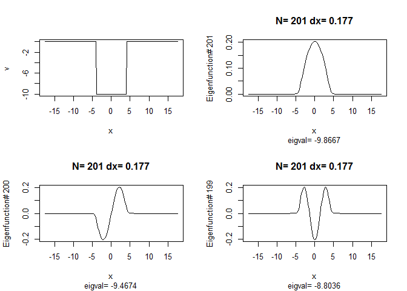
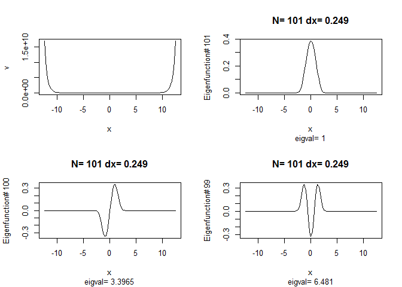
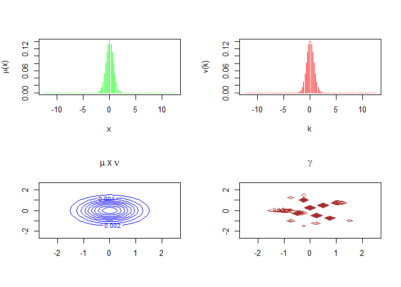
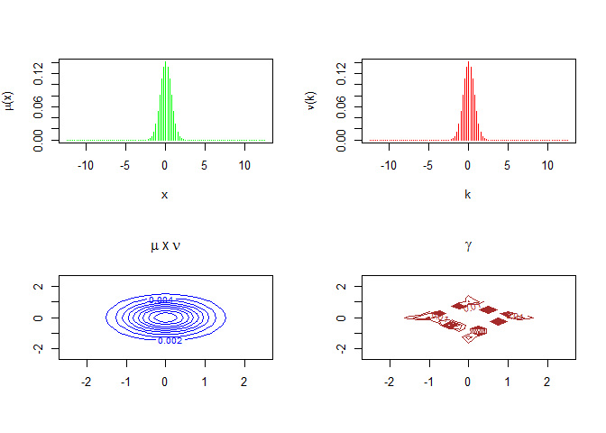
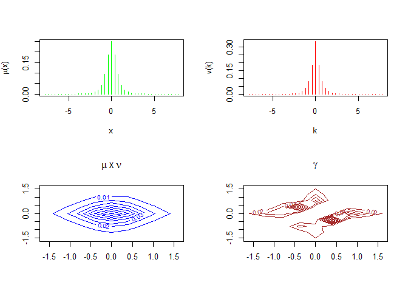

This is an [R Markdown](http://rmarkdown.rstudio.com) Notebook. When you execute code within the notebook, the results appear beneath the code.

Transference Plans and Uncertainty <https://arxiv.org/abs/1808.05710>

``` r
source('code/R/qmtrans.R')
```

    ## Warning: package 'transport' was built under R version 3.5.1

Add a new chunk by clicking the *Insert Chunk* button on the toolbar or by pressing *Ctrl+Alt+I*.

When you save the notebook, an HTML file containing the code and output will be saved alongside it (click the *Preview* button or press *Ctrl+Shift+K* to preview the HTML file).

The preview shows you a rendered HTML copy of the contents of the editor. Consequently, unlike *Knit*, *Preview* does not run any R code chunks. Instead, the output of the chunk when it was last run in the editor is displayed.

### Phase space grid `psgrid`

Let *M* be a positive integer, then `psgrid(M)` creates a (S4) instance of a 2-dimensional (*x*, *k*) grid with *N* × *N* points (*x*<sub>*i*</sub>, *k*<sub>*i*</sub>), where *i* = 1, …, *N* = 2*M* + 1. Note that we set *p* = ℏ*k*, then *k* has a dimension of *inverse length* (wavenumber).

    N ................ Number of points (=2*M+1) 
    L ................ Length, L=N*dx
    dx ............... x-spacing
    dk ............... k-spacing
    x ................ x-points x[1],...,x[N] (x[M]=0)
    k ................ k-points k[1],...,k[N] (k[M]=0)
    deMoivreNumber ... exp(2*pi*i/N)
    ucdftMatrix ...... Unitary centered discrete Fourier transform (matrix)
    dftv ............. dftv(v) -> ucdft of vector v
    dftf ............. dftf(f) -> ucdft of vector f
    idftv ............ idftv(v) -> inverse ucdft of vector v
    idftf ............ idftf(f) -> inverse ucdft of function f
    eval ............. eval(f) -> evaluate function f at x[1..N]
    evplot ........... evplot(f) -> eval(f) and plot the resulting vector
    plotv ............ plotv(v) -> plot vector v
    show ............. show() -> display/plot the grid

#### Example M=10

``` r
g=psgrid(10)
g@show()
```



``` r
crlf="\n"
cat("Grid parameters",crlf,
  "Number of points ...... :",g@N,crlf,
  "Length L .............. :",g@L,crlf,
  "x-spacing dx .......... :",g@dx,crlf,
  "k-spacing dx .......... :",g@dk,crlf,
  "DeMoivre number ....... :",g@deMoivreNumber,crlf)
```

    ## Grid parameters 
    ##  Number of points ...... : 21 
    ##  Length L .............. : 11.48681 
    ##  x-spacing dx .......... : 0.5469911 
    ##  k-spacing dx .......... : 0.5469911 
    ##  DeMoivre number ....... : 0.9555728+0.2947552i

``` r
g@evplot(sin)
```



    ##  [1]  0.7265407  0.9779200  0.9439293  0.6344875  0.1398938 -0.3955228
    ##  [7] -0.8155206 -0.9975386 -0.8884616 -0.5201197  0.0000000  0.5201197
    ## [13]  0.8884616  0.9975386  0.8155206  0.3955228 -0.1398938 -0.6344875
    ## [19] -0.9439293 -0.9779200 -0.7265407

### Schroedinger equation: `schroed1d`

The one dimensional Schroedinger equation
is solved on a `psgrid` using the matrix representation of *H*(*x*, ℏ*k*):
$$ H\_{i j} = V\_i \\delta\_{i j} + \\frac{h^2}{8 \\pi mN}  \\left\\{ \\begin{array}{l}
     \\frac{N^2 - 1}{6}, i = j\\\\
     (- 1)^{(i - j)}  \\frac{\\cos \\left( \\frac{\\pi (i - j)}{N}
     \\right) }{\\sin \\left( \\frac{\\pi (i - j)}{N} \\right)^2}, i \\neq j
\\end{array} \\right. . $$

An instance of `schroed1d(M,V,h=2*sqrt(2)*pi,m=1)` will contain the following parameters and methods:

    V ................ The potential V as function or vector
    h ................ Planck constant, default: h=2*sqrt(2)*pi
    m ................ Particle mass m, default: m=1
    H ................ The Hamilton matrix H
    ev ............... List of eigenvalues such that H v = ev[i] v 
    EV ............... Eigenvectors as columns of matrix EV
    plotEigVec ....... Plot eigenvector j (lowest for j=N).
    contains psgrid .. inherits psgrid(M)

#### Example 1: Harmonic Oscillator

The potential function *V*(*x*)=*x*<sup>2</sup> together with units and parameters *m* = 1, such that ℏ<sup>2</sup> = 2*m* yields - as is well known and easy to establish - the eigenvalues
that is the odd positive integers with the *Hermite functions* as eigenfunctions:

``` r
hosc=schroed1d(100,function(x){x^2})
```

The first 20 eigenvalues are (as expected):

``` r
rev(hosc@ev)[1:20]
```

    ##  [1]  1  3  5  7  9 11 13 15 17 19 21 23 25 27 29 31 33 35 37 39

The last 10 (of the 201) are not so precise anymore:

``` r
hosc@ev[1:10]
```

    ##  [1] 593.1937 555.2614 538.1407 520.5147 507.6309 495.1428 484.8351
    ##  [8] 474.7540 465.9999 457.4684

``` r
par(mfrow=c(2,2))
hosc@plotEigVec(hosc@N)
hosc@plotEigVec(hosc@N-1)
hosc@plotEigVec(hosc@N-2)
hosc@plotEigVec(hosc@N-3)
```



Let us compare the plots above with the first four Hermite functions:

``` r
par(mfrow=c(2,2))
nop=hosc@evplot(function(x){pi^(-1/4)*exp(-x^2/2)})
nop=hosc@evplot(function(x){sqrt(2)*x*pi^(-1/4)*exp(-x^2/2)})
nop=hosc@evplot(function(x){(2*x^2-1)/sqrt(2)*pi^(-1/4)*exp(-x^2/2)})
nop=hosc@evplot(function(x){(2*x^3-3*x)/sqrt(3)*pi^(-1/4)*exp(-x^2/2)})
```



**Note**: we see that the Hermite functions above are not normalized. In order to compare them, we have to normalize the resulting `eval` vector:

``` r
psi0=function(x){pi^(-1/4)*exp(-x^2/2)}
v0=hosc@eval(psi0)
v0=v0/sqrt(sum(v0*v0))
phi0=hosc@EV[,hosc@N]
par(mfrow=c(1,2))
hosc@plotEigVec(hosc@N)
hosc@plotv(v0)
```



``` r
df=phi0-v0
sum(df*Conj(df))
```

    ## [1] 4.617951e-28

#### Example 2: The finite potential well

``` r
V=function(x){as.integer(abs(x) < 4)*(-10)}
fpw=schroed1d(100,V)
par(mfrow=c(2,2))
vp=fpw@evplot(V)
fpw@plotEigVec(fpw@N)
fpw@plotEigVec(fpw@N-1)
fpw@plotEigVec(fpw@N-2)
```

 The bound states, for instance, can be listed as follows:

``` r
fpw@ev[fpw@ev<0]
```

    ## [1] -0.002880027 -1.759517076 -3.607999344 -5.267576102 -6.696707425
    ## [6] -7.878349365 -8.803618573 -9.467406382 -9.866727384

That is we have 9 negative eigenvalues (out of the 201). The theoretical number of bound states is
$$
   N\_b=\\lceil \\sqrt{\\frac{ m l^2 V\_0}{2 h^2}} \\rceil 
$$
 thus we calculate

``` r
ceiling(sqrt(1*8^2*10)/pi)
```

    ## [1] 9

as expected ;-)

#### Example 3: *V*(*x*)=*c**o**s**h*(*x*)\*(*c**o**s**h*(*x*)−1)

``` r
V3=function(x){cosh(x)*(cosh(x)-1)}
ex3=schroed1d(50,V3)
par(mfrow=c(2,2))
vp=ex3@evplot(V3)
ex3@plotEigVec(ex3@N)
ex3@plotEigVec(ex3@N-1)
ex3@plotEigVec(ex3@N-2)
```



### Kantorovich energy `kantorovich`

The Kantorovich energy of a state *ϕ* is given by
In the discrete case the optimal *γ* is a sparse matrix with (at most) 2*N* − 1 positive entries (out of *N*<sup>2</sup>). The *γ*-plots show the level sets (support).

An instance of `kantorovich(M,H,phi)` will contain the following parameters and methods:

    H ................. Hamilton function H(x,p)
    phi ............... Wave function phi(x)
    mu ................ Measure mu(x)
    nu ................ Measure nu(k)
    HM ................ Hamilton matrix H_ij=H(x_i,p_i)
    ES ................ Schroedinger energy
    EK ................ Kantorovich energy
    prodMeasure ....... Product measure mu#nu
    transfPlan ........ Transference plan (as comes from "transport")
    gamma ............. Measure gamma(x,k) corresponding to transfPlan
    display ........... Display results
    contains .......... Inherit from psgrid

#### Example 1: *H*(*x*, *k*)=*k*<sup>2</sup> + *x*<sup>2</sup>

``` r
H1=function(x,k){x^2+k^2}
K1=kantorovich(50,H1,function(x){exp(-x^2/2)})
```

``` r
K1@display()
```



``` r
K1@ES
```

    ## [1] 1

``` r
K1@EK
```

    ## [1] 1

#### Example 2: *H*(*x*, *k*)=*x*<sup>2</sup> \* *k*<sup>2</sup>

``` r
H2=function(x,k){x^2*k^2}
K2=kantorovich(50,H2,function(x){exp(-x^2/2)})
```

``` r
K2@display()
```



``` r
K2@ES
```

    ## [1] 0.25

``` r
K2@EK
```

    ## [1] 0.03301429

#### Example 3

``` r
K3=kantorovich(20,H2,function(x){1/(1+x^2)})
K3@display()
```



``` r
K3@ES
```

    ## [1] 0.4222049

``` r
K3@EK
```

    ## [1] 0.01640796
